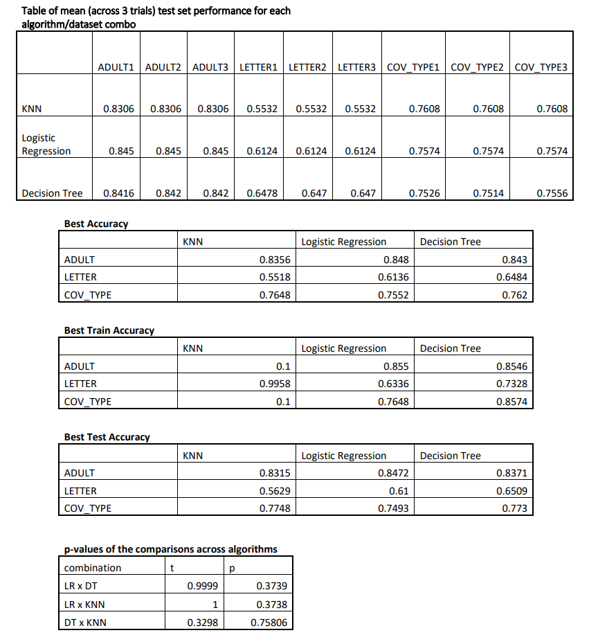

# **Supervised Learning Algorithm Comparisons**

This project aims to replicate and extend the comprehensive evaluation of supervised learning algorithms, inspired by the study conducted by Rich Caruana and Alexandru Niculescu-Mizil (CNM06). While the original study compared ten algorithms, this project focuses on three popular ones.

## **Background**
The last extensive evaluation of supervised learning algorithms was conducted in the 90s. Since then, the landscape of machine learning has evolved significantly. This project revisits the topic, drawing inspiration from the CNM06 study.

## **Objective**
Replicate the results of the CNM06 study, but with a focus on three algorithms: k-nearest neighbors, logistic regression, and decision trees. Various performance metrics are used for evaluation.

## **Original Study**
[An Empirical Comparison of Supervised Learning Algorithms Using Different Performance Metrics](https://drive.google.com/file/d/1BACN9m5HB4KYKPzZrNjg_KCg0FGEd5sL/view?usp=sharing) (Empirical Comparison)

## **Data Sets Used**
- [Adult Data Set](https://archive.ics.uci.edu/ml/datasets/adult)
- [Letter Recognition Data Set](https://archive.ics.uci.edu/ml/datasets/letter+recognition)
- [Covertype Data Set](https://archive.ics.uci.edu/ml/datasets/covertype)

## **Methodology**
The methodology closely follows the original Cornell study (Empirical Comparison). Three datasets from the UCI Machine Learning Repository were chosen. Each dataset underwent preprocessing as described in the CNM06 paper. For each classifier-dataset combination, three trials were conducted, totaling 27 trials. The hyperparameter tuning process and specific settings for each algorithm are detailed in the CNM06 paper.

## **Experiment**
A 5-fold cross-validation was performed on a training set of size 5000 for each dataset. The modeling process involved using pipelines for each algorithm on the training set. The best hyperparameters were chosen based on the performance during cross-validation. The accuracy of each model was computed for each trial, and the overall performance was determined by averaging the accuracies. Detailed performance metrics and comparisons can be found in the provided charts.

## **Results**

## **How to Run Locally**
1. Visit [Google Colab](https://colab.research.google.com) (Internet connection and Gmail account required).
2. Select "GitHub" in the open window and paste the project URL.
3. Download the desired dataset(s) and upload them to Google Colab using the 'Files' icon on the left sidebar.
4. Click 'Runtime' and select 'Run all'.
